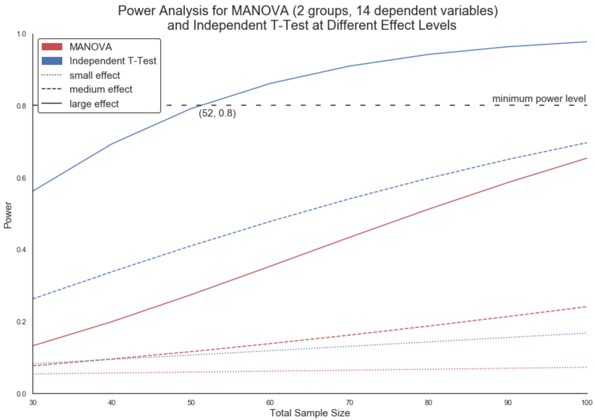

# A Comparison of Manual and eNest Assisted Monitoring of Bird Nest Boxes
This repository contains work for a study on manual and eNest assisted monitoring of chickadee (**Poecile sp.**) nest boxes following the NestWatch protocol by the Cornell Lab of Ornithology. Community science projects such as NestWatch expand the capability of researchers to collect data and increase interest in science and the natural world by providing opportunities for volunteers to get involved. Manual monitoring of bird nests through community science, however, faces challenges such as nest disturbance, poor data quality, and volunteer commitment limitations. Technology assisted monitoring of nest sites with devices such as eNest, a bird nest box data collection system, might address these concerns by providing continuous observation throughout the nesting season, and enrich data analysis through additional information from environmental metrics. Designed to be non-invasive, eNest has been field-tested in approximately 50 nest boxes. By comparing eNest to traditional bird nest monitoring methods, this study will also provide initial research on the suitability of eNest in bird nest boxes, and the integration of technology assisted nest box monitoring into community science project projects like NestWatch.In this repository is the work for the [experimental design](experimental_design.ipynb), [data submission app](data_submission_app.ipynb), and [statistical analysis](statistical_analysis.ipynb) of the study.

## Project Understanding
The study will take place in 2020 in the Greater Seattle Area, WA. Volunteers will be recruited from local Audubon Society Chapters between October 2019 and February 2020. All volunteers will complete NestWatch training for monitoring nest sites and using the eNest app. For the purpose of this study, nest sites are limited to chickadee nest boxes that will be provided to volunteers along with all eNest equipment (devices, micro SD cords). Data collection will begin March 1st, 2020. For more information, see the [study proposal](eNest_research_proposal.docx).

### Manual Monitoring
Manual data collection consists of visiting the nest box every 3-7 days to collect data on nest attempts. At the end of each nest attempt, the volunteer records a nest summary. For more information see the [Understanding NestWatch Data](https://nestwatch.org/learn/how-to-nestwatch/understanding-nestwatch-data/) on the NestWatch website.

### eNest Assisted Monitoring
eNest assisted monitoring consists of installing the eNest device at the beginning of the nesting season, and then analyzing the data for important nest events afterwards using the eNest App. 

The eNest device will run on battery or solar power for the entire nesting season, eliminating the need for any visits to the nest. It will collect 1-5 images a day, GPS coordinates, movement in seconds of motion per minute, humidity, temperature, light and air pressure. At the end of the nesting season, the volunteer will collect the eNest device, transfer data to a computer using a micro SD cord, and upload it to the eNest App. Using the eNest App, volunteers will visualize their data and identify relevant information to submit to NestWatch.  

## [Experimental Design](experimental_design.ipynb)
For the experimental design of this study, I have 2 groups (manual and eNest assisted monitoring) and the following 14 dependent variables:
* dates of nesting attempts
* number of nesting attempts
* nesting species
* number of eggs
* dates of first egg laid
* hatch dates
* number of nest parasitism events
* dates of nest parisitism events
* number of nest predation events
* dates of nest predation events
* final nest fate
* fledge dates
* host species count totals
* number of completed nest reports

I investigated conducting a series of independent t-tests with a Bonferroni correction to address multiple comparisons or using a Multivariate Analysis of Variance (MANOVA) to compare manual and eNest assisted monitoring of nest sites. The series of independent t-tests would evaluate differences between manual and eNest assisted monitoring at the level of each dependent variable, the MANOVA would allow for comparison in aggregate, treating all 14 dependent variables as a single vector. Using G\*Power, a statistical power analysis program, for both test types I calculated sample sizes at standard alpha and power thresholds (alpha = 0.05, power is no less than 0.8) with small, medium and large effect sizes. I graphed both power analyses with a total sample size range of 30 to 100, because 30 is the general rule of thumb for minimum sample size to meet assumptions of normality and I probably won't be able to recruit more than 100 volunteers per sample (more likely I could get 50 at the most).

I also investigated reducing the number of dependent variables for a MANOVA. The maximum number of variables I could do would be 7, with a total sample size of 98. All of the dependent variables seem important, and getting a total sample size of 98 might be challenging. I recommend going with the series of independent t-tests and using the Bonferroni correction to account for multiple comparisons. It would also be worthwhile to investigate alternative statistical analysis methods using Bayesion and computationally intensive methods.

## [Data Submission App](data_submission_app.ipynb)
The data submission app will be an enhanced version of the [eNest Dashboard](https://github.com/nkacoroski/animal_data_science_shiny_app), a data visualization app currently in development. Additional features will include a submission form for the NestWatch database.

## [Data Analysis](data_analysis.ipynb)
To be determined once data collection is completed in 2020. 

### Exploratory Data Analysis
Exploratory data analysis will be conducted to provide initial descriptions and visualizations of important nest event observations.

### Statistical Analysis
Hypothesis tests on important nest event observations will be evaluated using p-values and confidence intervals.

## Results
To be determined.

## Recommendations
To be determined.

## References
[Faul, F., Erdfelder, E., Lang, A.-G., & Buchner, A. (2007). G*Power 3: A flexible statistical power analysis program for the social, behavioral, and biomedical sciences. Behavior Research Methods, 39, 175-191.](http://www.psychologie.hhu.de/arbeitsgruppen/allgemeine-psychologie-und-arbeitspsychologie/gpower.html)